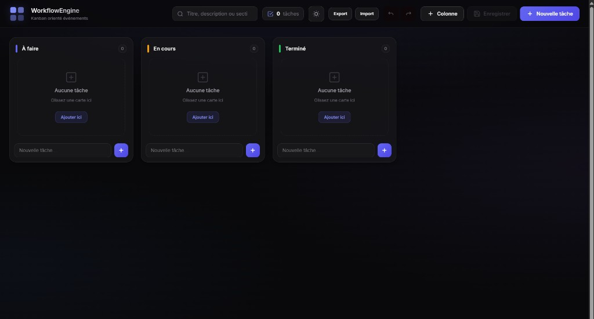
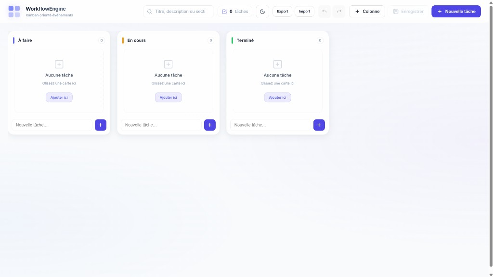
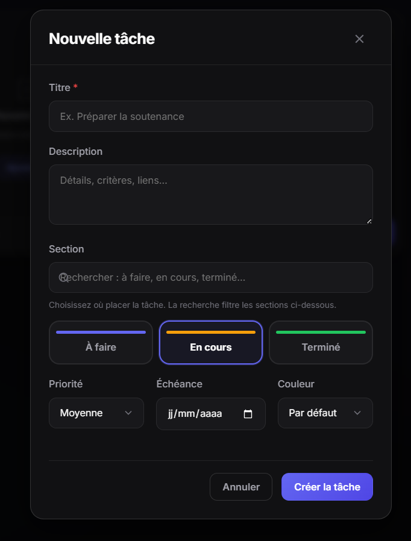
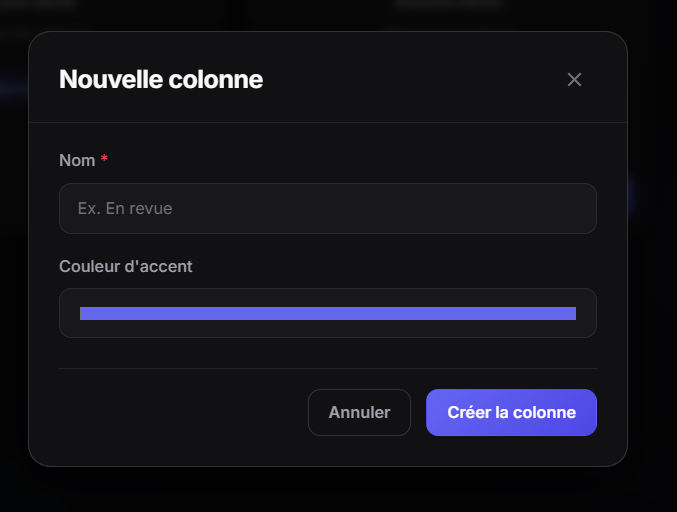

# WorkflowEngine – Trello/Kanban programmable orienté événements

##  Présentation

**WorkflowEngine** est une application web de gestion de tâches inspirée des outils Kanban comme **Trello**.

Le projet a été réalisé dans le cadre du module **Développement Web 2.0** en **Master 1 à l’ESTM**.

L’objectif principal est de concevoir une application interactive et modulaire reposant sur une **architecture orientée événements (EDA – Event Driven Architecture)**, tout en exploitant les APIs natives du navigateur et une manipulation avancée du DOM, **sans framework** (JavaScript vanilla).

---

##  Informations académiques

| | |
|---|---|
| **Établissement** | Ecole supérieure de Technologie et de Management |
| **Niveau** | Master 1  |
| **Module** | Développement Web 2.0 |
| **Projet** | WorkflowEngine – Trello/Kanban programmable orienté événements |
| **Année** | 2025 – 2026 |

---

## 👥 Participants

| Nom complet | Filière / spécialisation |
|-------------|--------------------------|
| Woré Taokreo Gnawé Parfait | Génie Logiciel |
| Diakarya Seck | Sécurité des Systèmes d'Information |
| Abdoulaye Haidara | Sécurité des Systèmes d'Information |
| Ousman Tahir Harane | Sécurité des Systèmes d'Information |
| Bichara Bakhit Aware | Sécurité des Systèmes d'Information |

---

##  Fonctionnalités principales

###  Niveau standard

- Création dynamique de **colonnes** Kanban (nom, couleur d’accent)
- Ajout, modification et suppression de **tâches** (modal)
- Ajout rapide de tâche en bas de chaque colonne
- Déplacement des tâches par **Drag & Drop** (API HTML5)
- Mise à jour visuelle en temps réel (sans rechargement de page)
- Recherche et filtrage (titre, description, nom de section)
- Sauvegarde automatique via **localStorage**
- Interface générée à partir de l’**état global** de l’application
- Couleur de carte, priorité, échéance
- Export / import du tableau en **JSON**

###  Niveau avancé

- Architecture orientée événements (**EDA**)
- **CustomEvent** et bus **Pub/Sub** (`eventBus.js`)
- **Délégation d’événements** sur le conteneur `#board`
- Historique des actions : **Undo** / **Redo** (pattern Commande)
- Modularité : un fichier par responsabilité (`board`, `tasks`, `columns`, …)
- Thème **clair / sombre** mémorisé

---

##  Technologies utilisées

| Catégorie | Détail |
|-----------|--------|
| **Frontend** | HTML5, CSS3, JavaScript (ES6 modules) |
| **APIs navigateur** | Drag & Drop, `localStorage`, `CustomEvent`, `FileReader` (import) |
| **Patterns** | Pub/Sub, Commande (undo/redo), rendu depuis le state |

- HTML5 (sémantique + balises `<template>`)
- CSS3 (variables CSS, responsive, thèmes)
- JavaScript vanilla (modules ES6)
- API Drag & Drop
- API `localStorage`
- API `CustomEvent`

---

##  Concepts techniques implémentés

### Gestion avancée du DOM

- Génération dynamique des colonnes et cartes
- Utilisation de `<template>` + `cloneNode(true)` (`js/utils/templates.js`)
- Mise à jour du DOM déclenchée par l’événement `stateChanged`
- Pas de rechargement de page

### Programmation événementielle

#### Délégation d’événements

Les interactions (clic, édition, suppression, drag & drop) sont centralisées sur le parent `#board` via `event.target.closest()`, ce qui évite d’attacher un listener sur chaque carte.

#### Custom Events

Des événements personnalisés découplent les modules :

```javascript
document.dispatchEvent(
  new CustomEvent('taskMoved', {
    detail: { taskId, fromColumn, toColumn },
  })
);
```

#### Pattern Observateur (Pub/Sub)

Le bus d’événements (`js/core/eventBus.js`) relie :

- le **board** (affichage, DnD),
- les **tâches** et **colonnes** (modals),
- la **recherche**,
- les **notifications** (toasts),
- le **state manager** et la **persistance**.

### Exemple de flux : déplacement d’une tâche

```text
Drop sur une colonne
    → history.execute(MoveTaskCommand)
    → state.moveTask()
    → publish("taskMoved") puis "stateChanged"
    → boardModule re-render
    → localStorage mis à jour
```

---

##  Structure du projet

```text
workflow-engine/
│
├── index.html              # Interface + balises <template>
├── css/
│   └── main.css            # Styles, thème clair/sombre
│
├── js/
│   ├── core/
│   │   ├── app.js          # Point d'entrée, initialisation
│   │   ├── constants.js    # Événements, sélecteurs, état par défaut
│   │   ├── eventBus.js     # Pub/Sub + CustomEvent
│   │   ├── stateManager.js # État global (tasks, columns, search)
│   │   ├── commands.js     # Pattern Commande (execute / undo)
│   │   └── commandHistory.js
│   │
│   ├── modules/
│   │   ├── board/          # Rendu Kanban, délégation, DnD
│   │   ├── tasks/          # Modal tâches
│   │   ├── columns/        # Modal colonnes
│   │   ├── search/         # Filtrage temps réel
│   │   ├── notifications/  # Toasts
│   │   ├── persistence/    # Bouton Enregistrer
│   │   ├── history/        # Undo / Redo (Ctrl+Z, Ctrl+Y)
│   │   ├── theme/          # Thème clair / sombre
│   │   └── exportImport/   # Export / import JSON
│   │
│   ├── services/
│   │   └── storageService.js
│   │
│   └── utils/
│       ├── templates.js    # cloneNode sur <template>
│       ├── dom.js, format.js, columns.js, copy.js, …
│
├── scripts/
│   └── smoke-test.mjs      # Tests logiques (Node)
│
├── Captures/               # Captures d’écran pour le README
└── README.md
```

> Les modèles HTML (`tpl-column`, `tpl-task-card`, …) sont dans `index.html`, pas dans des fichiers séparés.

---

##  Installation et exécution

### 1. Ouvrir le projet

Placer le dossier `workflow-engine` sur votre machine, puis ouvrir un terminal **à la racine** de ce dossier.

### 2. Lancer un serveur local (obligatoire)

Les **modules ES6** (`import` / `export`) ne fonctionnent pas en ouvrant `index.html` directement (`file://`). Utiliser un serveur HTTP :

**Python (recommandé)**

```bash
python -m http.server 8080
```

Puis ouvrir dans le navigateur :

```text
http://localhost:8080
```

**Alternatives :** extension **Live Server** (VS Code), ou `npx serve .`

### 3. Test rapide (optionnel)

```bash
node scripts/smoke-test.mjs
```

---

##  Persistance des données

Les données sont enregistrées localement :

```javascript
localStorage.setItem('workflow-engine:state', JSON.stringify(state));
```

- Sauvegarde **automatique** à chaque modification
- Bouton **Enregistrer** pour une sauvegarde manuelle explicite
- Les tâches et colonnes restent disponibles après **F5** (actualisation)

---

## Guide d’utilisation rapide

| Action | Comment faire |
|--------|----------------|
| Nouvelle tâche | **Nouvelle tâche** ou champ rapide en bas de colonne |
| Nouvelle colonne | Bouton **Colonne** |
| Modifier / supprimer | Icônes sur la carte ou l’en-tête de colonne |
| Déplacer | Glisser-déposer entre colonnes |
| Rechercher | Barre de recherche du header |
| Annuler / Rétablir | ↶ ↷ ou **Ctrl+Z** / **Ctrl+Y** |
| Export / Import | Boutons **Export** / **Import** (JSON) |
| Thème | Bouton soleil / lune |

---

## Objectifs pédagogiques atteints

Ce projet nous a permis de :

- comprendre la **programmation événementielle** (listeners, CustomEvent, bus),
- manipuler efficacement le **DOM** (sélecteurs, templates, délégation),
- implémenter une **architecture modulaire** sans framework,
- utiliser les **APIs natives** du navigateur (DnD, localStorage, fichiers),
- développer une application **dynamique** avec état centralisé,
- optimiser les performances via la **délégation d’événements**,
- appliquer le **pattern Commande** pour l’historique Undo/Redo.

---

##  Captures d’écran

Les images sont dans le dossier [`Captures/`](Captures/).

### 1. Interface principale du tableau Kanban (mode sombre)

*Fichier : `interface-kanban-mode-sombre.png`*



Vue d’ensemble avec les trois colonnes **À faire**, **En cours** et **Terminé**, la barre de recherche et les actions du header.

---

### 2. Interface principale du tableau Kanban (mode clair)

*Fichier : `interface-kanban-mode-clair.png`*



Même interface en **thème clair** (bascule soleil / lune dans le header).

---

### 3. Formulaire de création d’une tâche

*Fichier : `interface-creation-tache.png`*



Modal **Nouvelle tâche** : titre, description, choix de la section (colonnes), priorité, échéance et couleur.

---

### 4. Formulaire de création d’une colonne

*Fichier : `interface-creation-colonne.png`*



Modal **Nouvelle colonne** : nom et couleur d’accent pour personnaliser le tableau.

---


## Remerciements

Nous tenons à adresser nos sincères remerciements à notre professeur  **Ibrahima Gaye**, pour son encadrement, ses conseils avisés, sa disponibilité et son précieux soutien.
